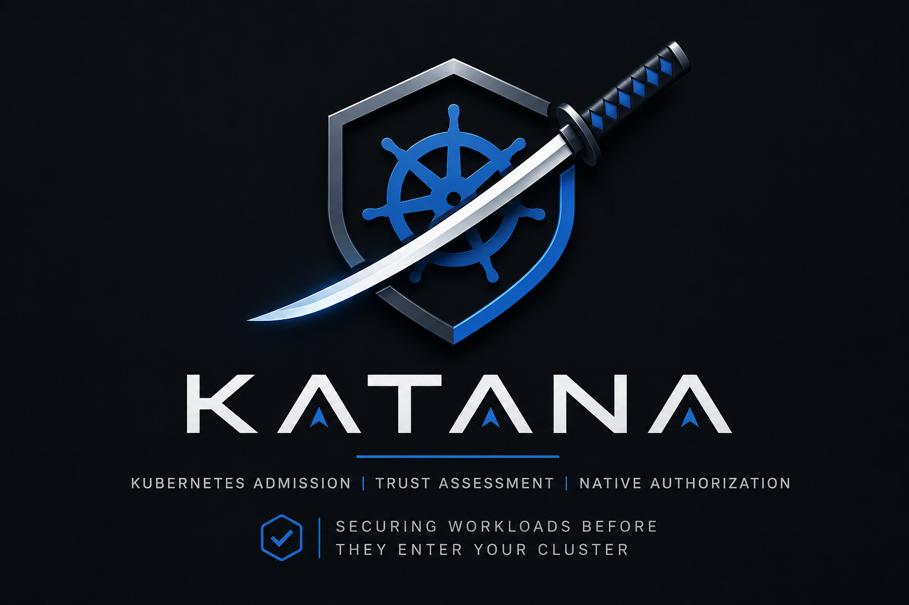
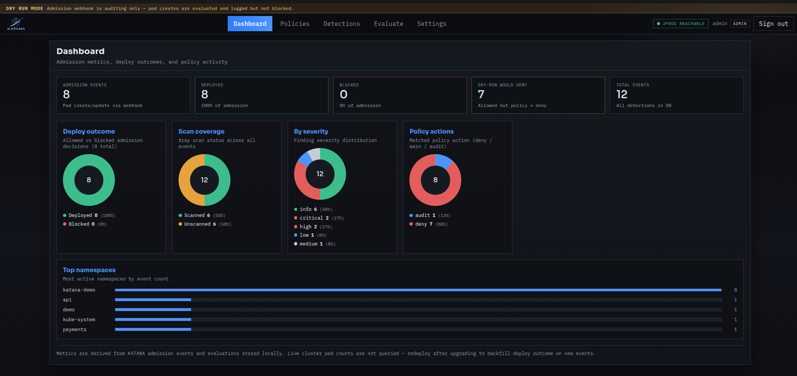
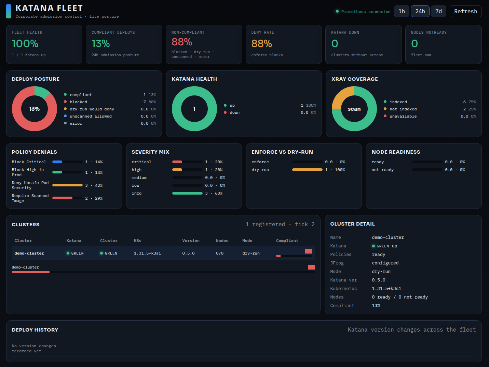
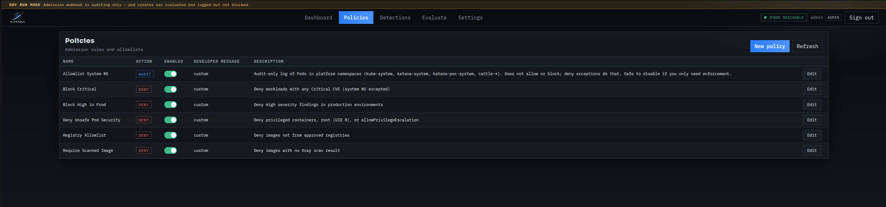
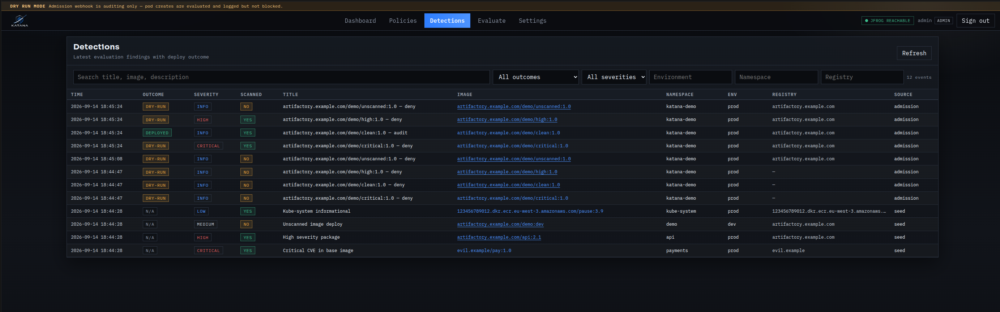
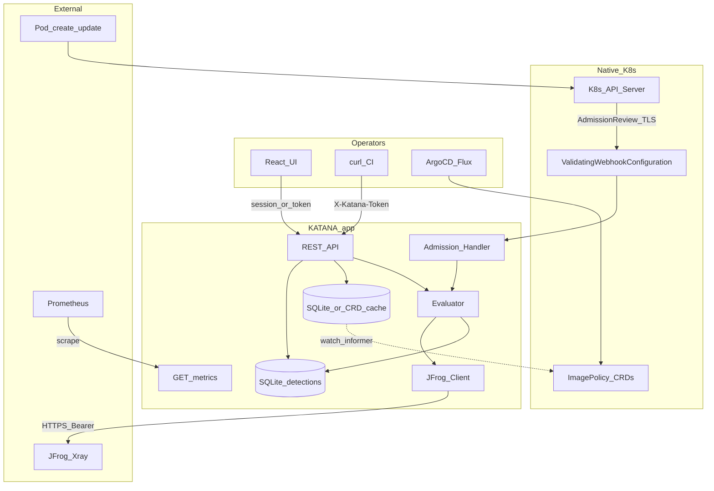
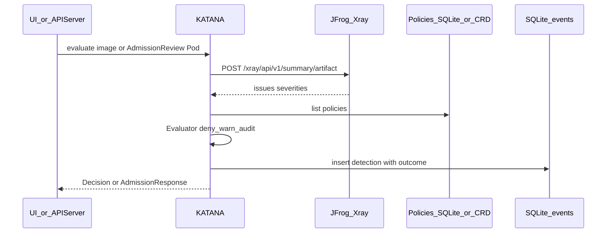
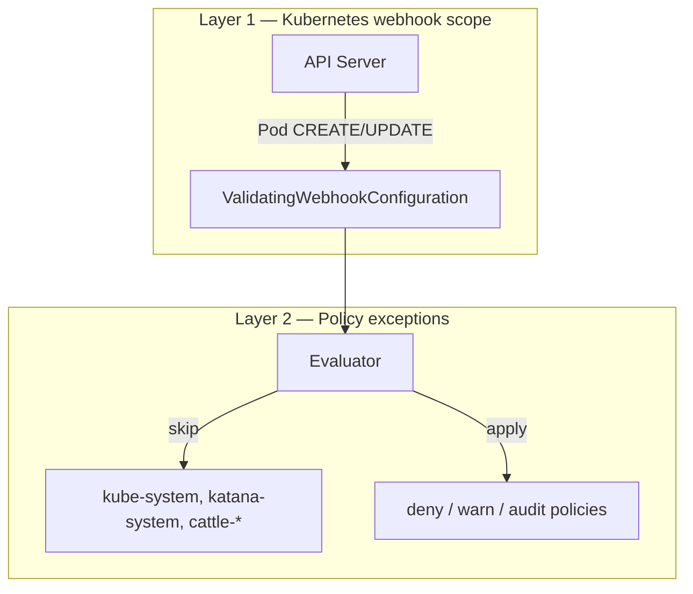
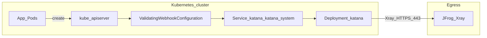
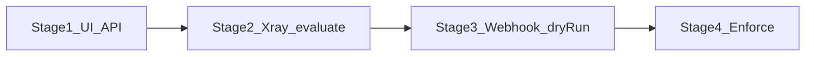

# KATANA

<p align="center">
  
</p>

**KATANA** (*Kubernetes Admission Trust Assessment & Native Authorization*) is a policy control plane for container images on Kubernetes.

Before a Pod lands in the cluster, KATANA asks **JFrog Xray** for vulnerability posture, matches configurable policies (`deny` / `warn` / `audit`), records detections, and can enforce the decision through a native **ValidatingAdmissionWebhook**. A separate **fleet** console aggregates Prometheus metrics across clusters.

The git remote may still be named `goxray`; product identifiers in code, env vars (`KATANA_*`), and Kubernetes resources use **katana**.

**Documentation:** [docs/AUTH.md](docs/AUTH.md) (users, roles, dry-run banner) · [docs/SSO.md](docs/SSO.md) (OIDC) · [docs/policies.md](docs/policies.md) (ImagePolicy rules) · [docs/FLEET.md](docs/FLEET.md) (Prometheus + fleet dashboard)

### Screenshots

| Per-cluster admin UI | Fleet NOC |
|:---:|:---:|
|  |  |
| Dashboard — deploy outcomes, Xray coverage, severity | Fleet — live posture across clusters |

<p align="center">
  <br/>
  <em>Policies — deny / warn / audit rules with developer messages</em>
</p>

<p align="center">
  <br/>
  <em>Detections — admission findings with dry-run / deployed outcome</em>
</p>

More UI captures (policy editor, detections detail): [`docs/screenshots/`](docs/screenshots/).

---

## Quick start (local)

**Terminal 1 — API**

```bash
cd /path/to/goxray          # clone path; remote name may still be goxray
cp -n .env.example .env     # edit locally; never commit secrets

export PATH="$HOME/.local/node/bin:$PATH"
export KATANA_AUTH_MODE=local
export KATANA_BOOTSTRAP_ADMIN_USER=admin
export KATANA_BOOTSTRAP_ADMIN_PASSWORD=admin
export KATANA_TOKEN=change-me-dev-token
export KATANA_ADDR=0.0.0.0:8080
export KATANA_DB_PATH=./data/katana.db
export KATANA_ADMISSION_DRY_RUN=true
# Optional — live Xray lookups (real Artifactory):
# export JFROG_URL=https://artifactory.example.com
# export JFROG_TOKEN='<identity-token>'
# export JFROG_TIMEOUT=90s
# export JFROG_PROXY=http://proxy.example.com:8080   # if needed from WSL
#
# Or use the local dummy Xray (see demo/README.md):
#   cd demo/dummy-jfrog && go run .
# export JFROG_URL=http://127.0.0.1:8081
# export JFROG_TOKEN=demo-token

make dev
```

**Local demo with canned Xray:** [`demo/README.md`](demo/README.md) · k3d webhook: `bash deploy/scripts/demo-k3d.sh`

**Terminal 2 — UI (hot reload, recommended while editing the UI)**

```bash
cd /path/to/goxray/web
export PATH="$HOME/.local/node/bin:$PATH"
npm install --omit=optional
npm run dev
```

| URL | What you get |
|-----|----------------|
| http://localhost:5173 | Vite dev UI (proxies `/api` → `:8080`) |
| http://localhost:8080 | API + built UI from `web/dist` (run `make web-build` first) |

Open **http://127.0.0.1:8080** (or the Vite dev URL). Sign in with the bootstrap admin (`admin` / `admin` by default). When `KATANA_ADMISSION_DRY_RUN=true`, a **DRY RUN MODE** banner appears at the top.

Optional: in **Settings → General**, save a legacy `X-Katana-Token` for curl/scripts (same value as `KATANA_TOKEN`).

---

| Layer | Tech |
|-------|------|
| API / webhook | Go 1.22+, chi, SQLite detections (`modernc.org/sqlite`) |
| Policies | SQLite (default) **or** `ImagePolicy` CRDs (`KATANA_POLICY_SOURCE=crd` on `main`) |
| UI | React + Vite — per-cluster admin (Dashboard, Policies, Detections, Evaluate, Settings) |
| Fleet | Separate `katana-fleet` pod + Prometheus — multi-cluster NOC ([docs/FLEET.md](docs/FLEET.md)) |
| Scan source | JFrog Platform Xray (`JFROG_URL` / `JFROG_TOKEN`) |
| Enforce | Native K8s `ValidatingAdmissionWebhook` → KATANA `POST /validate` (TLS) |
| Metrics | `GET /metrics` (Prometheus); identity label `KATANA_CLUSTER_NAME` |

---

## How it works

### Big picture

KATANA uses **native Kubernetes admission** for interception; policy evaluation and Xray lookups run inside the KATANA app (not in the API server).



**Who blocks a bad Pod?** The API server, when KATANA's webhook returns `allowed: false`. CRDs/SQLite only store **policy definitions** — not scan results.

### Evaluation flow (UI / API / webhook)

When an **image** is evaluated (manually or from a Pod admission):

1. Parse image → registry / name / tag / digest (`internal/imageutil`).
2. Ask Xray for an artifact summary (`internal/jfrog`):
   - Tries Artifactory-style paths (repo layouts and common aliases)  
     `default/<repo>/<path>/<tag>/list.manifest.json` and `manifest.json`.
3. Derive highest severity (`critical` > `high` > `medium` > `low`).
4. Load policies from **SQLite** (default) or **ImagePolicy CRDs** (`KATANA_POLICY_SOURCE=crd`) and run the evaluator (`deny` > `warn` > `audit` > default allow).
5. Namespace **exceptions** (exact or `cattle-*` prefix) skip matching policies.
6. Persist a **detection** with optional **deploy outcome** (`deployed` / blocked / dry-run) when recording is on.
7. Return decision to UI/API, or map it to `AdmissionResponse.allowed`.



### JFrog Xray data model

KATANA talks to **JFrog Platform Xray** over HTTPS with a Bearer token (`JFROG_TOKEN`). Implementation: `internal/jfrog`.

#### APIs used

| Call | Method / path | Purpose |
|------|---------------|---------|
| Ping | `GET /xray/api/v1/system/ping` | Integration health (`GET /api/v1/integrations/jfrog`) |
| Artifact summary | `POST /xray/api/v1/summary/artifact` | Vulnerability posture for an image |
| Fallback | `POST /xray/api/v2/summary/artifact` | Used only if v1 returns `404` |

#### What we send (request)

```json
{
  "paths": [
    "docker-quay-prod-remote-cache/brancz/kube-rbac-proxy/<tag>/list.manifest.json",
    "default/docker-quay-prod-remote-cache/brancz/kube-rbac-proxy/<tag>/list.manifest.json"
  ],
  "checksums": ["sha256:…"]
}
```

| Field | Type | When set |
|-------|------|----------|
| `paths` | `string[]` | Derived from image ref and/or explicit `repo` + `path` |
| `checksums` | `string[]` | When a digest / SHA is known (`ArtifactRef.Sha`) |

Path candidates for a Docker image typically include both `manifest.json` and `list.manifest.json`, with and without a `default/` prefix (common Artifactory layouts). See `dockerManifestPaths` in `internal/jfrog/client.go`.

#### What Xray returns (fields we parse)

Top-level response shape (only fields KATANA reads):

```json
{
  "artifacts": [
    {
      "general": {
        "name": "…",
        "path": "…"
      },
      "issues": [
        {
          "severity": "Critical",
          "issue_type": "security",
          "summary": "Short description",
          "issue_id": "XRAY-12345",
          "cves": [{ "cve": "CVE-2024-1234" }]
        }
      ],
      "error": ""
    }
  ],
  "errors": [
    { "error": "…" }
  ]
}
```

| Path | Type | Meaning in KATANA |
|------|------|-------------------|
| `artifacts[]` | array | First entry is used; empty ⇒ unscanned / unknown |
| `artifacts[].general.name` | string | Parsed but not used for policy today |
| `artifacts[].general.path` | string | Parsed but not used for policy today |
| `artifacts[].issues[]` | array | Security findings; counted by severity |
| `artifacts[].issues[].severity` | string | `Critical` / `High` / `Medium` / `Low` (case-insensitive); anything else → `unknown` |
| `artifacts[].issues[].issue_type` | string | Only `security` (or empty) is counted; other types are skipped |
| `artifacts[].issues[].issue_id` | string | Preferred label in `violations` |
| `artifacts[].issues[].cves[].cve` | string | Fallback label if `issue_id` is empty |
| `artifacts[].issues[].summary` | string | Last-resort label if no id / CVE |
| `artifacts[].error` | string | Artifact-level failure → `scanned=false` |
| `errors[].error` | string | Top-level failure when no artifacts returned |

Other Xray summary fields (licenses, components, etc.) may be present in the raw payload but are **ignored**.

#### Normalized model (`ScanSummary`)

After parsing, KATANA exposes this structure to evaluate / API / UI:

| Field | Type | Source |
|-------|------|--------|
| `artifact` | `{repo, path, sha, image_ref}` | Request coordinates |
| `scanned` | `bool` | `true` when an artifact with no error was returned |
| `critical` / `high` / `medium` / `low` / `unknown` | `int` | Counts of security issues by severity |
| `violations` | `string[]` | Human labels like `XRAY-12345 (critical)` or `CVE-… (high)` |
| `error` | `string` | HTTP / decode / Xray error text when lookup failed |

Highest severity from those counts becomes the policy input (`critical` > `high` > `medium` > `low`). If `scanned` is `false` (empty artifacts, Xray error, or `not_indexed`), policies such as **Require Scanned Image** can deny. The UI may still show **0/0** CVE counts — that means no scan data, not a clean image. Lookups are cached in memory for **5 minutes** (success and not-indexed; errors are not cached as “unavailable”). Violation lists in detections are capped at 25 entries.

---

### Policy model

Each policy has:

- `action`: `deny` | `warn` | `audit`
- `match`: severity, environment, scanned flag, namespace allowlist, registry allowlist, pod security flags
- `exceptions`: namespaces that skip this policy (`kube-system`, `katana-system`, `cattle-*`, …)

**Seeded defaults** (see `configs/default-policies.yaml` and [`docs/policies.md`](docs/policies.md)):

1. **Block Critical** — deny if severity is critical  
2. **Block High in Prod** — deny high when environment is `prod`  
3. **Require Scanned Image** — deny if Xray has no scan  
4. **Allowlist System NS** — audit log for platform namespaces (does not allow or block; exceptions on the denies do). See [`docs/policies.md`](docs/policies.md#allowlist-system-ns-policy-4).
5. **Registry Allowlist** — deny registries outside the approved list  
6. **Deny Unsafe Pod Security** — deny root (UID 0), privileged, or `allowPrivilegeEscalation` containers  

Precedence: first matching **deny** wins; else **warn**; else **audit**; else allow.

At admission, KATANA evaluates **pod security first** (policy 6), then **per-container image policies** (1–5, via Xray). The **Evaluate** tab/API only runs image checks — not pod `securityContext`.

Policies support **custom developer messages** (`deny_message` / `denyMessage`) shown in `kubectl apply` when a workload is blocked. Kubernetes reads the webhook `AdmissionResponse.status` object (`Failure` / `Forbidden` / `403`); the policy text is `status.message`. Edit via the Policies UI rule builder or CRD/GitOps.

**Storage modes** (`KATANA_POLICY_SOURCE`):

| Mode | Where policies live | Branch / use |
|------|---------------------|---------------|
| `sqlite` (default) | Per-pod SQLite DB | local dev, single-replica |
| `crd` | Cluster `ImagePolicy` CRDs in etcd | GitOps, multi-replica |

See [`docs/policies.md`](docs/policies.md) for match fields, FAQ, and test commands. CRD install: [`deploy/README.md`](deploy/README.md#native-imagepolicy-crds).

### Detections and deploy outcome

Each admission event records:

| Field | Meaning |
|-------|---------|
| `source` | `admission` (webhook) or `evaluate` (manual) |
| `policy_action` | `deny` / `warn` / `audit` matched |
| `deployed` | `true` = pod created; `false` = webhook blocked |
| `dry_run` | `true` = allowed despite deny policy (observe mode) |

The **Detections** tab shows badges: **Deployed** (green), **Blocked** (red), **Dry-run** (orange).

The **Dashboard** tab aggregates admission metrics (`GET /api/v1/stats/summary`): deployed vs blocked counts, severity breakdown, top namespaces.

## Configuration

### Environment variables

| Variable | Required | Default | Purpose |
|----------|----------|---------|---------|
| `KATANA_TOKEN` | yes | — | Shared secret for REST API / UI (`X-Katana-Token` header) |
| `KATANA_ADDR` | no | `0.0.0.0:8080` | Listen address (`0.0.0.0:8443` + TLS in cluster) |
| `KATANA_DB_PATH` | no | `./data/katana.db` | SQLite database path |
| `KATANA_ADMISSION_DRY_RUN` | no | `true` | When `true`, webhook always allows but logs what it *would* deny |
| `KATANA_ADMISSION_TIMEOUT` | no | `8s` | Per-request evaluation budget (keep below webhook `timeoutSeconds`) |
| `KATANA_ADMISSION_MAX_INFLIGHT` | no | `16` | Concurrent admission evaluations |
| `KATANA_NONPROD_NAMESPACES` | no | `dev,qa,*-sandbox` | Namespaces evaluated as env=`dev` (suffix glob `*-sandbox` supported) |
| `KATANA_CLUSTER_NAME` | fleet | hostname / `unknown` | Prometheus `cluster` label; also `CLUSTER_NAME` |
| `KATANA_POLICY_SOURCE` | no | `sqlite` | `sqlite` or `crd` (Kubernetes ImagePolicy CRDs) |
| `KATANA_TLS_CERT` / `KATANA_TLS_KEY` | cluster | — | TLS cert/key for webhook Service (required in EKS) |
| `KATANA_LOG_LEVEL` | no | `info` | Log verbosity (reserved) |
| `JFROG_URL` | for Xray | — | e.g. `https://artifactory.example.com` |
| `JFROG_TOKEN` | for Xray | — | Bearer token (server-side only, never in browser) |
| `JFROG_TIMEOUT` | no | `90s` | HTTP timeout for Xray calls |
| `JFROG_LOOKUP_BATCH_TIMEOUT` | no | — | Cap for batched Xray lookups during admission |
| `JFROG_PROXY` | no | env proxy | Override HTTP(S) proxy for Xray calls |

Copy [`.env.example`](.env.example) to `.env` for local dev. In Kubernetes, set values in the `katana-secrets` Secret (prefer External Secrets in production).

### Namespace scope — which Pods get scanned?

KATANA uses **two independent layers**. Both matter:



#### Layer 1: `ValidatingWebhookConfiguration` (which namespaces call the webhook)

| Mode | Config | Effect |
|------|--------|--------|
| **All namespaces (default)** | No `namespaceSelector` in [`deploy/k8s/katana.yaml`](deploy/k8s/katana.yaml) | Every Pod CREATE/UPDATE in the cluster is sent to KATANA |
| **Opt-in namespaces** | Uncomment `namespaceSelector` with label `katana.dev/enforce=true` | Only labelled namespaces trigger the webhook |

**Default (cluster-wide)** — ship as-is for production coverage (~90–100% of workloads):

```yaml
# deploy/k8s/katana.yaml — namespaceSelector is commented out
rules:
  - resources: ["pods"]
    operations: ["CREATE", "UPDATE"]
```

**Opt-in (pilot / gradual rollout)** — label each namespace you want:

```bash
kubectl label ns my-app katana.dev/enforce=true
```

Then uncomment in `katana.yaml`:

```yaml
namespaceSelector:
  matchExpressions:
    - key: katana.dev/enforce
      operator: In
      values: ["true"]
```

#### Layer 2: Policy `exceptions` (which namespaces skip deny rules)

Even when the webhook runs, each policy can **skip** namespaces via `exceptions`. Seeded defaults exclude platform namespaces from **Block Critical**, **Require Scanned Image**, etc.:

- `kube-system`
- `katana-system`
- `cattle-*` (prefix match)

Edit in the **Policies** UI or via API. Example: allow a dev namespace to bypass **Block Critical** while still auditing:

```json
"exceptions": ["kube-system", "katana-system", "cattle-*", "my-dev-ns"]
```

#### Recommended rollout for a real cluster

1. Deploy with `KATANA_ADMISSION_DRY_RUN=true` and `failurePolicy: Ignore` (manifest defaults).
2. Use **cluster-wide** webhook (default) or opt-in labels for a pilot namespace first.
3. Validate **Evaluate** tab + **Detections** with known good/bad images.
4. Set `KATANA_ADMISSION_DRY_RUN=false` on the Deployment when ready to enforce.
5. Optionally set `failurePolicy: Fail` once Xray latency is proven (webhook timeout is 10s).

When `KATANA_ADMISSION_DRY_RUN=true`, critical images are **still allowed** but recorded in Detections with a dry-run warning.

### UI tabs

| Tab | Purpose |
|-----|---------|
| **Dashboard** | Admission metrics — deployed/blocked %, severity charts, top namespaces |
| Policies | List / create / edit / enable policies |
| Detections | Findings with **Outcome** badges (Deployed / Blocked / Dry-run) + filters |
| Evaluate | Dry-run an image against Xray + policies |
| Settings | API token (browser) + JFrog status (server-side only) |

Fleet posture (pies, cluster cards, deploy history) is a **separate** UI on `katana-fleet` — not a tab in this admin app. See [`docs/FLEET.md`](docs/FLEET.md).

JFrog tokens are **never** stored in the browser. Only `KATANA_TOKEN` (admin API) may live in `localStorage` for UI calls.

---

## Local development

See **Quick start** above for the usual two-terminal flow (`make dev` + `npm run dev`).

### Requirements

- Go 1.22+
- Node 20+ (`export PATH="$HOME/.local/node/bin:$PATH"` if installed under `~/.local/node`)
- Make (optional)

### Build & run (production-like UI on :8080)

```bash
make build          # builds web/dist + bin/katana
./bin/katana        # serves UI + API on KATANA_ADDR
```

```bash
make test
make certs    # optional webhook TLS for local experiments
```

### API

| Method | Path | Auth |
|--------|------|------|
| GET | `/api/v1/health` | no — includes `policy_source`, `policies_ready` |
| GET | `/api/v1/stats/summary` | `X-Katana-Token` |
| GET | `/api/v1/integrations/jfrog` | `X-Katana-Token` |
| POST | `/api/v1/evaluate` | `X-Katana-Token` |
| GET/POST | `/api/v1/policies` | `X-Katana-Token` |
| GET/PUT/PATCH/DELETE | `/api/v1/policies/{id}` | `X-Katana-Token` |
| GET | `/api/v1/detections` | `X-Katana-Token` — filter `?outcome=deployed\|blocked\|dry-run` |
| GET | `/metrics` | no — Prometheus scrape (restrict with NetworkPolicy) |
| POST | `/validate` | no API token (TLS + network trust) |

Example evaluate:

```bash
curl -s -H "X-Katana-Token: $KATANA_TOKEN" -H 'Content-Type: application/json' \
  -d '{"image":"artifactory.example.com/team/app:1.2.3","namespace":"demo","environment":"prod"}' \
  http://127.0.0.1:8080/api/v1/evaluate
```

---

## Deploy on Kubernetes

KATANA must run **inside the target cluster** (or on a path the API server can reach) because the admission webhook is called **synchronously** by `kube-apiserver` on Pod CREATE/UPDATE.



### Placement recommendations

| Topic | Recommendation |
|-------|----------------|
| Namespace | Dedicated `katana-system` (or your platform namespace) |
| Network | Egress **TCP/443** to your Artifactory / Xray URL (and HTTP proxy if required) |
| Exposure | **ClusterIP** for the webhook; expose the UI via internal Ingress only |
| Secrets | External Secrets / Sealed Secrets for `JFROG_TOKEN`, `KATANA_TOKEN`; never bake into the image |
| HA | Start 2 replicas once DB is moved off local SQLite emptyDir (see roadmap) |
| Enforce scope | **Cluster-wide** Pod CREATE/UPDATE by default; `kube-system`, `katana-system`, and `cattle-*` excluded via policy exceptions. Optional per-NS opt-in: uncomment `namespaceSelector` in `deploy/k8s/katana.yaml`. |

### Prerequisites

1. **RBAC** to create Namespace, Deployment, Service, Secrets, and `ValidatingWebhookConfiguration` (usually cluster-admin).
2. Container image pushed to a registry the cluster can pull.
3. Network allow-list for Xray / Artifactory HTTPS from the KATANA pods.
4. TLS certificate for `katana.katana-system.svc` (cert-manager, or `deploy/scripts/gen-webhook-certs.sh` for lab).

### Build & push image

```bash
docker build -t registry.example.com/<team>/katana:0.2.0 .
docker push registry.example.com/<team>/katana:0.2.0
```

Use the `Dockerfile` in this repo (multi-stage: admin UI + Go binary). Fleet console image: `docker build --target fleet` (see [`docs/FLEET.md`](docs/FLEET.md)).

### Apply manifests

Manifests live in [`deploy/k8s/katana.yaml`](deploy/k8s/katana.yaml). Step-by-step: [`deploy/README.md`](deploy/README.md).

```bash
# 1) Namespace + secrets (prefer ExternalSecrets in real envs)
kubectl apply -f deploy/k8s/katana.yaml   # edit image + secrets first

# 2) TLS for webhook
bash deploy/scripts/gen-webhook-certs.sh deploy/certs
kubectl -n katana-system create secret tls katana-webhook-tls \
  --cert=deploy/certs/tls.crt --key=deploy/certs/tls.key

# 3) Patch ValidatingWebhookConfiguration.caBundle with:
base64 -w0 deploy/certs/tls.crt

# 4) Update Deployment image to your pushed tag
kubectl -n katana-system set image deploy/katana katana=registry.example.com/<team>/katana:0.2.0

# 5) Start with KATANA_ADMISSION_DRY_RUN=true, then set false when ready to enforce
```

For CRD-backed policies on cluster, set `KATANA_POLICY_SOURCE=crd` and run `bash deploy/scripts/apply-crd.sh` (plus RBAC in `katana-rbac-crd.yaml`, which also grants `nodes` get/list/watch for fleet gauges).

### Rollout stages (recommended)



1. **Stage 1** — Deploy Deployment + Service + UI; validate Settings / Evaluate.
2. **Stage 2** — Confirm Xray paths for your registries.
3. **Stage 3** — Webhook active (`failurePolicy: Ignore`, `KATANA_ADMISSION_DRY_RUN=true`). Watch Detections.
4. **Stage 4** — Set `KATANA_ADMISSION_DRY_RUN=false`; tighten `failurePolicy` to `Fail` when latency to Xray is proven.

### Env vars in cluster

| Variable | Role |
|----------|------|
| `KATANA_TOKEN` | Admin API / UI |
| `JFROG_URL` | e.g. `https://artifactory.example.com` |
| `JFROG_TOKEN` | Identity / access token (read on Xray) |
| `KATANA_ADDR` | `0.0.0.0:8443` behind TLS |
| `KATANA_TLS_CERT` / `KATANA_TLS_KEY` | Webhook serving certs |
| `KATANA_ADMISSION_DRY_RUN` | `true` until ready |
| `KATANA_POLICY_SOURCE` | `sqlite` (default) or `crd` |
| `KATANA_CLUSTER_NAME` | Fleet identity (`cluster` Prometheus label) |
| `KATANA_ADMISSION_TIMEOUT` | Admission budget (e.g. `8s`) |
| `KATANA_DB_PATH` | `/data/katana.db` (emptyDir = ephemeral; use PVC for persistence) |
| `JFROG_TIMEOUT` | HTTP timeout for Xray (default `90s`) |
| `JFROG_LOOKUP_BATCH_TIMEOUT` | Cap for batched Xray lookups |
| `JFROG_PROXY` | HTTP(S) proxy override if needed |

### GitOps pattern

Preferred production path:

1. Publish the image via CI to your registry.
2. Commit Helm/manifests to the cluster GitOps repo (Argo CD / Flux).
3. Manage secrets with a platform secret store (External Secrets, Sealed Secrets, etc.), not plain Secret YAML.
4. Allow egress to any new Artifactory / Xray FQDNs your cluster does not already reach.

---

## Repository layout

```
cmd/katana/              process entrypoint
cmd/fleet/               fleet console (Prometheus + SQLite history)
internal/api/            REST + middleware
internal/policy/         models + evaluator + tests
internal/policystore/    SQLite or CRD-backed policy store
internal/evaluate/       image evaluation orchestration
internal/jfrog/          Xray HTTP client
internal/admission/      ValidatingAdmissionWebhook handler
internal/metrics/        Prometheus exporter (`GET /metrics`)
internal/fleet/          fleet PromQL client + snapshot store
internal/store/          SQLite detections + legacy policy CRUD
internal/detect/         detection model (+ deploy outcome fields)
internal/imageutil/      image ref parsing
web/                     React admin UI (Dashboard, Policies, Detections, …)
web-fleet/               React fleet / NOC UI
configs/                 default policy YAML reference
deploy/k8s/              Kubernetes manifests
deploy/crd/              ImagePolicy CRD + default policies
deploy/scripts/          CRD apply, webhook certs, JFrog helpers
scripts/                 dev-api.sh, dev-ui.sh (local helpers)
Dockerfile               Katana image (default) + `docker build --target fleet`
```

**Branches:** `main` — SQLite default locally; CRD mode on cluster (`KATANA_POLICY_SOURCE=crd`).

---

## Roadmap

- ~~Dashboard + admission outcome tracking~~ (done)
- ~~ImagePolicy CRDs~~ (done on `main`)
- ~~OIDC for UI~~ (done — see [`docs/SSO.md`](docs/SSO.md))
- ~~Metrics (Prometheus) + fleet dashboard~~ (done — [`docs/FLEET.md`](docs/FLEET.md))
- Persistent DB (Postgres) + multi-replica webhook  
- cert-manager Certificate + automatic `caBundle` injection  
- Richer Xray path resolution (checksum / package search)  
- Structured audit export to SIEM  
- Optional integration with existing OPA/Gatekeeper policies

---

## License

Apache-2.0 
