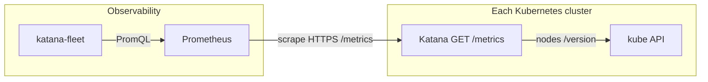

# KATANA Fleet — Prometheus + multi-cluster dashboard

Katana exports native Prometheus metrics. A **separate** fleet-console pod queries Prometheus and shows a multi-cluster overview (posture pies, cluster cards, deploy history).

There is **no cluster registry API**. A cluster appears in the UI when Prometheus has series with label `cluster=<name>`.



---

## Katana exporter

| Item | Detail |
|------|--------|
| Endpoint | `GET /metrics` (Prometheus text; **unauthenticated** — restrict with NetworkPolicy) |
| Identity | `KATANA_CLUSTER_NAME` (fallback `CLUSTER_NAME`, else `unknown`) |
| RBAC | `nodes` get/list/watch (see [`katana-rbac-crd.yaml`](../deploy/k8s/katana-rbac-crd.yaml)) |

### Series

| Metric | Meaning |
|--------|---------|
| `katana_info{cluster,version,policy_source,dry_run}` | Process identity (gauge 1) |
| `katana_policies_ready` | CRD informer synced / sqlite ready |
| `katana_jfrog_up` | JFrog client configured |
| `katana_cluster_nodes{status="ready\|not_ready"}` | Node inventory |
| `katana_cluster_info{k8s_version}` | API server version |
| `katana_admission_requests_total{result}` | `allow` / `deny` / `error` / `timeout` / `overloaded` |
| `katana_admission_outcomes_total{outcome}` | `compliant` / `blocked` / `dry_run_would_deny` / `unscanned_allowed` / `error` |
| `katana_admission_severity_total{severity}` | Highest image severity on admission |
| `katana_admission_policy_total{policy,action}` | Matched ImagePolicy |
| `katana_xray_lookups_total{status}` | `indexed` / `not_indexed` / `unavailable` |

Admission duration and Xray lookup histograms are also exported.

---

## How clusters show up

1. Each Katana Deployment sets `KATANA_CLUSTER_NAME` (e.g. `my-cluster`).
2. Prometheus scrapes that instance (`honor_labels: true` so Katana’s `cluster` label wins).
3. Fleet queries `katana_info` and groups by `cluster`. First time a name appears, the UI adds a row.

**Add another cluster:** deploy Katana there with a unique `KATANA_CLUSTER_NAME`, then add a scrape target (or `file_sd`) in Prometheus. No UI onboarding form.

When a shared Prometheus / Thanos / Mimir already exists, point fleet at it with `PROMETHEUS_URL`.

---

## Fleet console

| Item | Detail |
|------|--------|
| Binary | `cmd/fleet` |
| UI | `web-fleet/` (Vite + React) |
| Image | `docker build --target fleet` → `registry.example.com/<team>/katana-fleet:<tag>` |
| Env | `PROMETHEUS_URL`, `FLEET_ADDR` (default `:8090`), `FLEET_DB_PATH`, optional `FLEET_TOKEN` |
| History | SQLite snapshots every 30s; version changes → deploy timeline |

### UI

- Window: 1h / 24h / 7d
- Pies: deploy posture (compliant vs blocked vs unscanned vs error), Katana up/down, Xray coverage
- Bars: policy denials, severity, enforce vs dry-run, node readiness
- Cluster table + drill-down (k8s version, nodes, Katana version)
- Deploy history: Katana version from → to per cluster

### Local (optional)

```bash
export PROMETHEUS_URL=http://127.0.0.1:9090
go run ./cmd/fleet
# UI: cd web-fleet && npm install && npm run dev   # proxies /api → :8090
```

### Build images

```bash
docker build --build-arg KATANA_VERSION=0.5.0 -t registry.example.com/<team>/katana:0.5.0 .
docker build --target fleet --build-arg KATANA_VERSION=0.5.0 \
  -t registry.example.com/<team>/katana-fleet:0.5.0 .
docker push registry.example.com/<team>/katana:0.5.0
docker push registry.example.com/<team>/katana-fleet:0.5.0
```

Deploy Katana with [`deploy/k8s/katana.yaml`](../deploy/k8s/katana.yaml), then run fleet against your Prometheus (or a sidecar scrape config of your choosing). Prefer a new image tag after rebuilding so registries do not serve a stale digest.

Probe metrics from inside the cluster:

```bash
kubectl -n katana-system run curl-m --rm -i --restart=Never \
  --image=curlimages/curl:latest -- \
  curl -sk https://katana.katana-system.svc/metrics | head
```

---

## Status lights

| Signal | Green | Red / amber |
|--------|-------|-------------|
| Katana | Prometheus `up{job="katana"}==1` and `katana_policies_ready==1` | Stale scrape or policies not ready |
| Cluster | Katana up and `not_ready` nodes = 0 | Amber if some NotReady; red if Katana down |

Posture pies use `increase()` over the selected window, and fall back to **raw counters** if the window has no delta yet (first scrapes).
