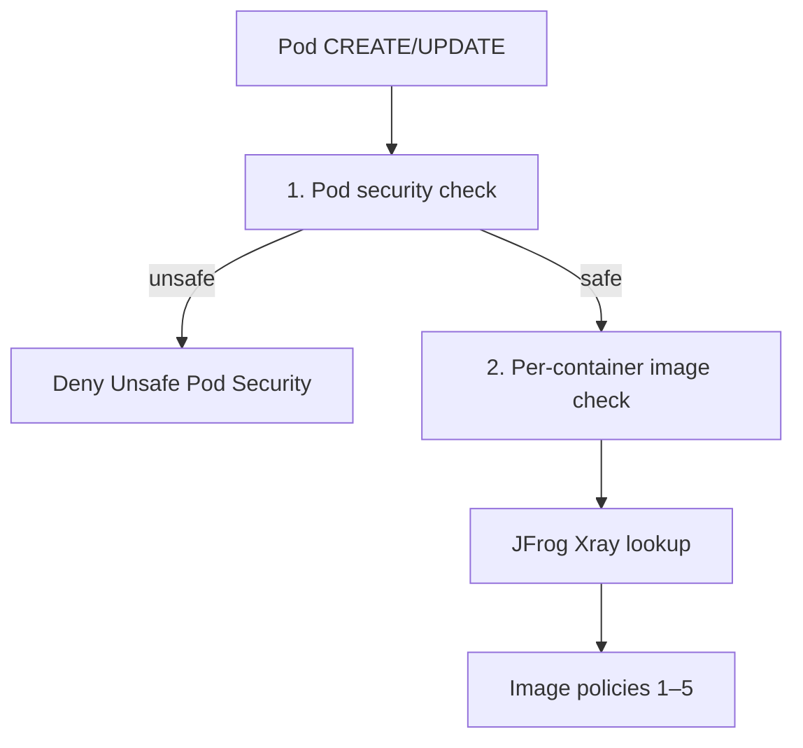
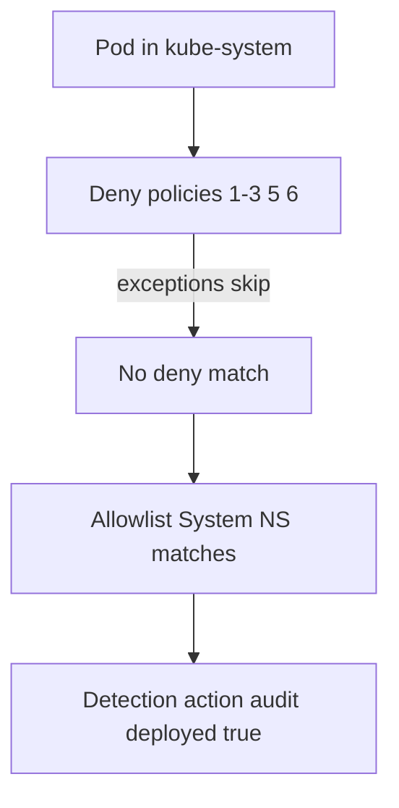

# KATANA policies — reference

This document answers the most common questions about how KATANA policies work, where they are stored, and how to test them.

---

## What is a policy?

A **policy** is a rule that KATANA evaluates when a Pod is created or updated (admission webhook) or when you use the **Evaluate** tab/API.

Each policy has:

| Field | Description |
|-------|-------------|
| `action` | `deny` — block the Pod · `warn` — allow but flag · `audit` — log only |
| `match` | Conditions that must be true for the policy to apply (see [Match fields](#match-fields)) |
| `exceptions` | Namespaces where this policy is **skipped** (exact name or prefix wildcards like `platform-*`) |
| `enabled` | When `false`, the policy is ignored |

**Precedence:** if any enabled policy matches with `deny`, the Pod is blocked (unless `KATANA_ADMISSION_DRY_RUN=true`). Otherwise `warn`, then `audit`, then default allow.

**Who actually blocks the Pod?** The Kubernetes API server, when KATANA's webhook returns `allowed: false`. Policies are only **definitions** — scan results come from JFrog Xray at evaluation time.

---

## Where do policies live?

KATANA supports two storage modes (`KATANA_POLICY_SOURCE`):

| Mode | Storage | Best for |
|------|---------|----------|
| `sqlite` (default) | SQLite file in the KATANA pod (`KATANA_DB_PATH`) | Local dev, single-replica |
| `crd` | **`ImagePolicy` CRDs** in the cluster (etcd) | Production, GitOps, multiple KATANA replicas |

### CRD mode (recommended for clusters)

Policies are **cluster-scoped** Kubernetes resources:

```bash
kubectl get imagepolicies.katana.dev
kubectl describe imagepolicy deny-unsafe-pod-security
```

- **CRD definition:** `deploy/crd/imagepolicy-crd.yaml`
- **Default policies (GitOps):** `deploy/crd/default-imagepolicies.yaml`
- **Install:** `bash deploy/scripts/apply-crd.sh`

Changes to CRDs are picked up by KATANA via a watch/informer — no pod restart needed.

### SQLite mode

Policies are seeded from `configs/default-policies.yaml` on first start and editable via the **Policies** UI or REST API (`/api/v1/policies`). They live in the SQLite DB, not in etcd.

---

## Default policies (6)

These ship in both `configs/default-policies.yaml` (SQLite) and `deploy/crd/default-imagepolicies.yaml` (CRD):

| # | Name | Action | What it checks |
|---|------|--------|----------------|
| 1 | **Block Critical** | deny | Xray severity = `critical` |
| 2 | **Block High in Prod** | deny | Xray severity = `high` **and** environment = `prod` |
| 3 | **Require Scanned Image** | deny | Image has no Xray scan (`scanned=false`) |
| 4 | **Allowlist System NS** | audit | Log Pods in platform namespaces — does **not** allow or block ([details](#allowlist-system-ns-policy-4)) |
| 5 | **Registry Allowlist** | deny | Image registry not in the approved list |
| 6 | **Deny Unsafe Pod Security** | deny | Pod runs as root, is privileged, or allows privilege escalation |

Platform namespaces (`kube-system`, `kube-public`, `kube-node-lease`, `katana-system`) are in **exceptions** for deny policies 1–3, 5, and 6 so cluster infrastructure is not blocked. That skip is what actually lets those Pods through. Policy 4 only records that they happened.

For Rancher-managed clusters, add optional exceptions from [`configs/examples/rancher-exceptions.yaml`](../configs/examples/rancher-exceptions.yaml).

Approved registries (policy 5):

- `artifactory.example.com`
- `123456789012.dkr.ecr.us-east-1.amazonaws.com` (AWS documentation placeholder account/region)

---

## Two evaluation paths at admission

When the webhook receives a Pod, KATANA runs **two checks** in order:



1. **Pod security** — inspects `securityContext` on the Pod and each container/init container. No Xray call.
2. **Image policies** — for each container image, queries Xray and evaluates severity, scanned flag, registry, etc.

Pod security runs **before** image checks so an unsafe Pod is rejected even if the image is clean.

---

## Match fields

| Match field | Applies to | Meaning |
|-------------|------------|---------|
| `severity` | Image | Xray highest severity (`critical`, `high`, …) |
| `environment` | Image | Namespace-derived: default `prod`. Namespaces listed in `KATANA_NONPROD_NAMESPACES` evaluate as `dev`. Pod labels are ignored. |
| `scanned` | Image | `false` = no Xray result for this image |
| `registryAllowlist` | Image | With `deny`: match when the registry is **not** on the list. With `audit`/`warn`: match when it **is** on the list |
| `namespaceAllowlist` | Image | Policy only applies **in** these namespaces (not an exemption). Prefix wildcards (`platform-*`) are supported |
| `unsafePodSecurity` | Pod | Any unsafe security context (see below) |
| `privileged` | Pod | At least one container has `privileged: true` |
| `runAsRoot` | Pod | Container runs as UID 0 or `runAsNonRoot: false` |
| `allowPrivilegeEscalation` | Pod | At least one container has `allowPrivilegeEscalation: true` |

Environment is **not** taken from Pod labels (those are attacker-controlled). Admission uses the namespace:

- default → `prod` (so **Block High in Prod** applies unless the namespace is listed as non-prod)
- `KATANA_NONPROD_NAMESPACES=dev,qa,*-sandbox` → those namespaces evaluate as `dev`

The evaluate API can still send an explicit `environment` field for dry-run checks.

Do not confuse `namespaceAllowlist` with `exceptions`:

| Field | Effect |
|-------|--------|
| `match.namespaceAllowlist` | Policy **fires only** in those namespaces |
| `exceptions` | Policy is **skipped** in those namespaces |

---

## Allowlist System NS (policy 4)

The name is misleading. This is **not** an allowlist and it does **not** grant permission. It is an `audit` rule for visibility in platform namespaces.

### What it matches

When a Pod is admitted in one of:

- `kube-system`
- `kube-public`
- `kube-node-lease`
- `katana-system`

…the policy matches and records a detection (`action: audit`). It does **not** look at CVEs, scan status, registry, or Pod `securityContext`.

`audit` never blocks. Precedence is `deny` > `warn` > `audit` > default allow, so this policy cannot override a deny.

### Why it exists

Deny policies 1–3, 5, and 6 list those same namespaces under **exceptions**. That is intentional: blocking CNI, CoreDNS, or KATANA itself would take the cluster down.

The side effect: those Pods skip every deny and would otherwise leave **no detection**. Policy 4 fills that gap — “platform namespace activity, allowed on purpose, still logged.”



| Layer | What it does for system NS |
|-------|----------------------------|
| Deny `exceptions` | Lets the Pod through (required for the cluster) |
| **Allowlist System NS** | Writes an audit detection so the event is not silent |

Without policy 4, a Critical image in `kube-system` is still allowed (exceptions). You just would not see it in Detections.

### What it does not do

- Does **not** allow namespaces that would otherwise be denied — exceptions already did that.
- Does **not** enforce registry, scan, or severity in system NS.
- Does **not** replace webhook scope. If the webhook never sees the namespace, this policy never runs.

### Do you need it?

**Not for enforcement.** Turning it off does not change admit/deny. Keep the **exceptions** on the deny policies.

Keep it if you want a trail of platform Pod creates/updates (audit, dashboard, “we still observe kube-system”).

Disable or delete it if:

- You only care about blocking images in app namespaces (typical pilot).
- Detections are too noisy (`kube-system` churn often).
- The webhook is **opt-in** (`katana.dev/enforce=true`). System namespaces usually do not have that label, so this policy **never fires** for unlabelled namespaces and is unused.

### How to disable

**SQLite / UI:** set `enabled: false` on **Allowlist System NS**.

**CRD:**

```bash
kubectl patch imagepolicy allowlist-system-ns --type merge -p '{"spec":{"enabled":false}}'
```

---

## Pod security policy (policy 6)

**Deny Unsafe Pod Security** blocks Pods when any **container** (including init/ephemeral) is unsafe after inheriting pod-level `runAsUser` / `runAsNonRoot`:

| Condition | Example |
|-----------|---------|
| Root (UID 0) | `securityContext.runAsUser: 0` |
| Unspecified UID | no `runAsUser` / `runAsNonRoot` (image USER is often 0) |
| Explicit non-root disabled | `runAsNonRoot: false` |
| Privileged | `securityContext.privileged: true` |
| Privilege escalation | `allowPrivilegeEscalation: true` **or omitted** (Kubernetes default is true) |

**Safe example** (allowed):

```yaml
securityContext:
  runAsNonRoot: true
  runAsUser: 101
  allowPrivilegeEscalation: false
```

### Important limitations

- Evaluated only at **admission** (Pod create/update), **not** in the **Evaluate** tab — Evaluate only checks a single image against Xray, not Pod `securityContext`.
- An empty pod-level `securityContext: {}` is **inheritance only**. Kubernetes always materializes that object; treating it as a container would false-deny every Pod (`allowPrivilegeEscalation` omitted). Privileged / UID / escalation are checked on containers, using the pod-level UID fields when the container does not set them.
- Does not replace a full Pod Security Standards / OPA setup; it covers the most common unsafe patterns KATANA sees in image admission flows.
- Standalone Pods and Deployments are both intercepted the same way (webhook sees the Pod spec).

---

## Webhook scope vs policy exceptions

These are **two independent layers**:

| Layer | Controls | Example |
|-------|----------|---------|
| **Webhook scope** | Which namespaces trigger KATANA at all | Pilot: only NS with `katana.dev/enforce=true` |
| **Policy exceptions** | Which namespaces skip a specific deny rule | `kube-system` skips Block Critical |

A Pod in `kube-system` may still be sent to the webhook (if cluster-wide), but deny policies with `kube-system` in `exceptions` will not block it. **Allowlist System NS** can still match and audit that admission. If the webhook is opt-in only, `kube-system` is never sent to KATANA and policy 4 does nothing.

---

## Custom developer messages

Each policy can define a **deny message** (and **warn message**) shown to developers when `kubectl apply` is blocked.

| Field | CRD (`crd` mode) | SQLite / API |
|-------|------------------|--------------|
| Deny message | `spec.denyMessage` | `deny_message` |
| Warn message | `spec.warnMessage` | `warn_message` |

**Template variables:** `{policy}`, `{image}`, `{severity}`, `{environment}`, `{namespace}`, `{registry}`, `{reason}`

Example:

```yaml
denyMessage: |
  Image {image} has CRITICAL vulnerabilities. Policy: {policy}.
  Upgrade the base image or contact your platform security team.
```

If no custom message is set, KATANA falls back to the policy `description`, then an auto-generated message.

The same text appears in **Detections** when a workload is blocked.

`kubectl apply` only prints that text when the webhook `AdmissionResponse` JSON uses Kubernetes’ **`status`** field (`metav1.Status`: `status=Failure`, `reason=Forbidden`, `code=403`). A payload keyed `result` is ignored by the API server, so the CLI would only show a generic “denied” with no policy message.

---

## Common questions

### Why is there an “Allowlist System NS” policy? Does it allow those namespaces?

No. The name is leftover wording. It is `audit` only: log Pods in `kube-system`, `kube-public`, `kube-node-lease`, and `katana-system`. What actually lets those namespaces through is `exceptions` on the **deny** policies. You can disable policy 4 without changing enforcement. See [Allowlist System NS](#allowlist-system-ns-policy-4).

### Why does a Critical image in kube-system show ALLOW (or audit) instead of DENY?

**Block Critical** (and the other denies) skip `kube-system` via **exceptions**, so the cluster stays up. If **Allowlist System NS** is enabled and the webhook saw the Pod, the matched action is `audit` and `deployed=true`. That is expected, not a scanner miss.

### Why does an image with HIGH CVEs get ALLOW in dev?

**Block High in Prod** matches when environment is `prod`. Admission defaults every namespace to `prod` unless it is listed in `KATANA_NONPROD_NAMESPACES`. Pod labels like `env: dev` are ignored. For a demo namespace, set `KATANA_NONPROD_NAMESPACES=katana-demo` (or a prefix pattern).

### Why does an image show unscanned / DENY when it exists in Artifactory?

**Require Scanned Image** checks **Xray**, not Artifactory presence. If the image is in Artifactory but not indexed in Xray (`not_indexed`, or the token cannot read it), `scanned=false` and the Pod is denied.

The Evaluate tab / Dashboard can show **0 Critical / 0 High** for that case: those counters default to zero when there is no scan. That is **not** a clean image — it is unscanned. Demo namespaces often except Require Scanned so evaluate/deploy can still allow; do not copy those exceptions to prod.

### Where can I see blocked deployments?

- **Detections** tab in the UI (filter by Blocked)
- API: `GET /api/v1/detections?outcome=blocked`
- Fields: `deployed=false`, `policy_action=deny`, `source=admission`

### How do I add or change a policy?

**CRD mode:**

```bash
kubectl edit imagepolicy block-critical
# or GitOps: edit deploy/crd/default-imagepolicies.yaml and apply
```

**SQLite mode:** Policies UI or `PUT /api/v1/policies/{id}`.

### Dry-run vs enforce

| Setting | Behaviour |
|---------|-----------|
| `KATANA_ADMISSION_DRY_RUN=true` | Pods always created; denials logged with `dry_run=true` |
| `KATANA_ADMISSION_DRY_RUN=false` | Matching `deny` policies block Pod creation |

Toggle enforce with:

```bash
kubectl -n katana-system set env deploy/katana KATANA_ADMISSION_DRY_RUN=false   # enforce
kubectl -n katana-system set env deploy/katana KATANA_ADMISSION_DRY_RUN=true    # observe
```

---

## Testing policies

### Image policies (registry, scanned, severity)

Use the **Evaluate** tab or `POST /api/v1/evaluate` with known good/bad images against your registries. In a lab namespace with the webhook in scope:

```bash
# Expect deny when docker.io is outside the registry allowlist
kubectl -n demo run test-hub --image=docker.io/library/nginx:alpine --restart=Never

# Expect allow for an approved, scanned image (adjust to your registry)
kubectl -n demo run test-ok --image=artifactory.example.com/team/app:1.2.3 --restart=Never
```

### Pod security (root, privileged, safe)

With enforce mode ON and a namespace labelled `katana.dev/enforce=true` (if using opt-in webhook scope):

| Test | Pod | Expected |
|------|-----|----------|
| A | `runAsUser: 0` | Blocked |
| B | `privileged: true` | Blocked |
| C | non-root UID (e.g. 101) | Allowed |

```bash
kubectl delete pod test-root test-privileged test-safe -n demo --ignore-not-found
```

---

## Related files

| Path | Purpose |
|------|---------|
| `configs/default-policies.yaml` | SQLite seed / reference |
| `deploy/crd/default-imagepolicies.yaml` | CRD defaults for GitOps |
| `deploy/crd/imagepolicy-crd.yaml` | CRD schema |
| `internal/policy/evaluator.go` | Match logic |
| `internal/admission/podsecurity.go` | Pod securityContext analysis |
| `internal/admission/webhook.go` | Admission orchestration |

See also [README.md](../README.md) and [deploy/README.md](../deploy/README.md).
